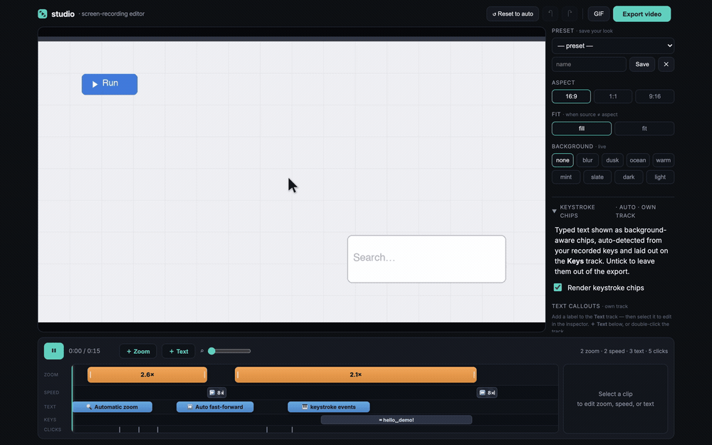
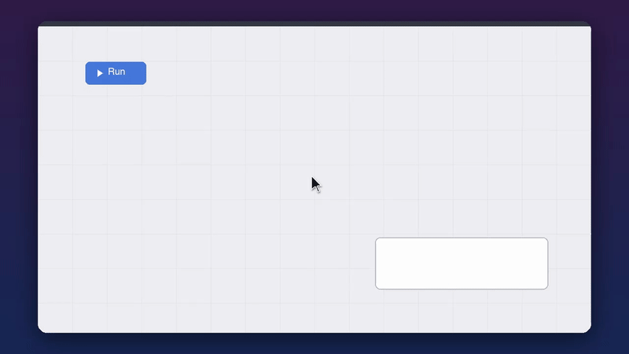

# screenstudio-alt

  

**Turn a raw screen recording into a polished, Screen-Studio-style demo — auto-zoom on clicks, idle speed-up, keystroke chips, smoothed cursor, 9:16 vertical — headless, from the command line or your coding agent.**



## Why / vs Screen Studio

[Screen Studio](https://screen.studio) by [Adam Pietrasiak](https://github.com/pie6k) is a gorgeous, beloved macOS app — that you *click through*, on a paid subscription. screenstudio-alt does the same signature effects **headless and free**.

| | 🆓 **screenstudio-alt** | 💎 Screen Studio |
|---|---|---|
| 💰 Price | Free, open-source (MIT) | Paid subscription ($9–20/mo; free to use, paywalled on export) |
| 🖥️ Interface | CLI + local web editor | Polished native GUI |
| 🔍 Auto-zoom on clicks | ✅ | ✅ |
| ⏩ Idle speed-up | ✅ | ✅ |
| ⌨️ Keystroke chips | ✅ | ✅ |
| 🖱️ Smoothed cursor | ✅ | ✅ |
| 📱 9:16 vertical | ✅ | ✅ |
| 🏷️ Text callouts (bg + location aware) | ✅ | ❌ |
| 🎬 FCPXML handoff | ✅ | ➖ partial |
| 🤖 Headless · scriptable · CI · agent-driven | ✅ | ❌ |
| ✨ GUI polish & ease-of-use | rougher | best-in-class |

**Honest:** if you want a polished native app and don't mind paying, Screen Studio is excellent — buy it. If you want to *automate* demo polish for free, or have a coding agent make demos, use this.

*Lineage: in the spirit of [VHS by Charm](https://github.com/charmbracelet/vhs) — scriptable, reproducible demos — but for full screen recordings, not just the terminal.*

## What it does

- 🔍 **Auto-zoom** onto clicks (and typing bursts) — eased, and crisp (re-samples the original frames)
- ⏩ **Idle speed-up** — dead time compressed automatically; a playing animation is never sped up
- ⌨️ **Keystroke chips** rendered like real typing
- 🖱️ **Smoothed cursor** + click ripple + a real click sound
- 🏷️ **Text callouts** — screen-fixed labels that auto-flip light/dark to stay legible on any background and sit at the edges, off your content
- 📱 **9:16 vertical** that follows the action — plus 16:9 / 1:1
- 🎬 **Non-destructive render** — zooms re-sample the source, so they stay sharp
- 🛠️ **Local timeline editor** (drag zoom regions, retime idle spans) + **multi-clip** sequencing
- 🎞️ **FCPXML** export to Resolve / Final Cut / Premiere



*One render pass: auto-zoom, idle speed-up, smoothed cursor + click ripple, a framed backdrop, and background-aware **callouts** — the labels in the clip are the callouts feature labeling the others.*

> 🥚 **Easter egg:** type a BPM and it'll **beat-cut** your clips onto the music grid for a synced reel. That kind of feature is a one-flag add *because* the whole tool is scriptable — on-the-fly expandability is the point.

## Get it

It's a Claude Code skill — **tell your coding agent to add `screenstudio-alt`** and it installs and drives the whole thing. Or add it directly:

```
/plugin marketplace add connerkward/screenstudio-alternative-skill
```

<details>
<summary>Run it by hand (CLI)</summary>

```bash
pip install -r requirements.txt && brew install ffmpeg
swiftc -O src/events-log.swift -o src/events-log        # one time

./src/events-log demo.events.jsonl & LOGGER=$!
screencapture -v -V 30 demo.mov ; kill $LOGGER
python3 src/polish.py demo.mov --events demo.events.jsonl --speedup --zoom --keys --vertical
```

`--speedup` alone works on **any** existing recording (no events). Prefer a GUI?
`python3 src/studio.py demo.mov` opens a local timeline editor. Full internals →
[docs/ARCHITECTURE.md](docs/ARCHITECTURE.md).
</details>

## License

MIT © Conner K Ward

---

🧭 **[ckw-skills](https://github.com/connerkward/ckw-skills)** — part of Conner K. Ward's collection of Claude Code skills & MCP servers.
